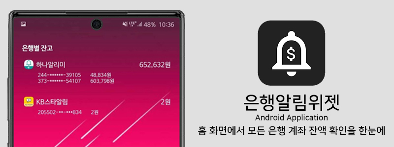

# Notification-Log-Widget
 Test Widget created by Elvis Kemevor for Notification Log
 https://github.com/alwise/Notification-Log-Widget

 # 은행 계좌 잔고 위젯

### 1. [세부 설명]
### 2. [진행 사항]
 

### 3. 소개
이 [repository]를 기반으로 만들었습니다. 

은행 계좌의 입송금으로 인해 발생하는 Notification을 Parsing해 필요한 정보를 위젯으로 정리해 표출하는 안드로이드 어플리케이션 입니다.

<b>사용불가은행</b> : 신한, 부산, 우체국?

<b>테스트완료은행</b> : 하나, 국민, 농협, 카카오, SC제일, 우리, 기업, 신협

[repository]: https://github.com/alwise/Notification-Log-Widget
[세부 설명]: ./detail.md
[진행 사항]: ./history.md
